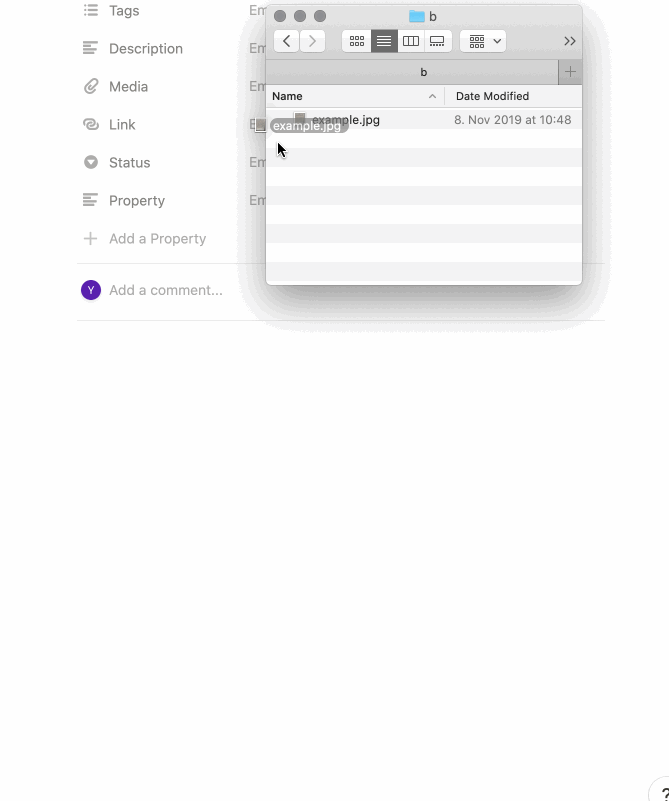
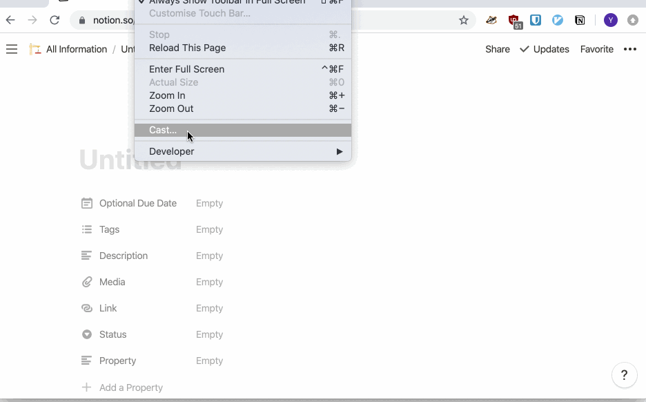

# notion-ocr: 🖼 to ✍ for Notion

Make your images searchable in Notion!

Notion is a great alternative to Evernote, but one feature that is still greatly missed, is that the text in your images is searchable as well. Notion promises to do this someday, but it's not there yet, so this is the alternative.

This tool allows you to add the words `add_ocr` below any image in your notion account and it will try to extract the text from the image and put it below the image. Thus making the text searchable.



### Install

#### Prerequisites Tesseract

You'll need [tesseract](https://github.com/tesseract-ocr/tesseract), as it is used for doing the actual ocr in the image.

##### Mac

```
brew install tesseract
```

Without brew check [installing](https://github.com/yannick-cw/notion-ocr/releases) tesseract.

##### Linux

```
sudo apt install tesseract-ocr
```

Without apt check [installing](https://github.com/yannick-cw/notion-ocr/releases) tesseract.

Make sure `tesseract` works as a command in the terminal!

#### Install notion-ocr

##### Mac

With Homebrew:

```
brew install yannick-cw/homebrew-tap/notion-ocr
```

With wget:

```
wget https://github.com/yannick-cw/notion-ocr/releases/download/0.1.1/notion-ocr_mac.zip \
  && unzip notion-ocr_mac.zip \
  && chmod +x notion-ocr \
  && ./notion-ocr --help
```

You should see this now

```bash
notion-ocr - enrich images with the text in the image
...
```

You can run it now from the current directory with
`./notion-ocr-0.1_mac/bin/notion-ocr`

Or just get the latest release from [releases](https://github.com/yannick-cw/notion-ocr/releases).

You can also move the executable into your `PATH` to make running it more convenient.

##### Linux

With wget:

```
wget https://github.com/yannick-cw/notion-ocr/releases/download/0.1.1/notion-ocr_x86_64-linux.zip \
  && unzip notion-ocr_x86_64-linux.zip \
  && chmod +x notion-ocr \
  && ./notion-ocr --help
```

You should see this now

```bash
notion-ocr - enrich images with the text in the image
...
```

You can run it now from the current directory with
`./notion-ocr`

Or just get the latest release from [releases](https://github.com/yannick-cw/notion-ocr/releases).

You can also move the executable into your `PATH` to make running it more convenient.

### Running it

1. Get the `token_v2` token from https://www.notion.so/

- when using chrome [here](https://developers.google.com/web/tools/chrome-devtools/storage/cookies) is some info on how to read a cookie



2. Run `notion-ocr` with the token

- `notion-ocr -t "token_here" -s 10` or if not in your path `./notion-ocr -t "token_here" -s 10`
- the `-s` option specifies to scan every `x` minutes and can also be left out to run just once

3. In the line **right** below any image in notion write `add_ocr`, the next time the tool runs, it replaces that with the text scanned from the image.

### Trouble Shooting

- Did you install `tesseract`? Is it executable from the terminal?
- Did you write the line `add_ocr` exactly in the line below the image?

### Known Limitations

- Does not yet work with handwriting
- Small images might lead to bad results
- Not sure if other languages beside English work right now
- when you get `Failed loading language `eng` you might need to install the tesseract eng language pack`, e.g. on Arch I needed to run `pacman -S tesseract-data-eng`
